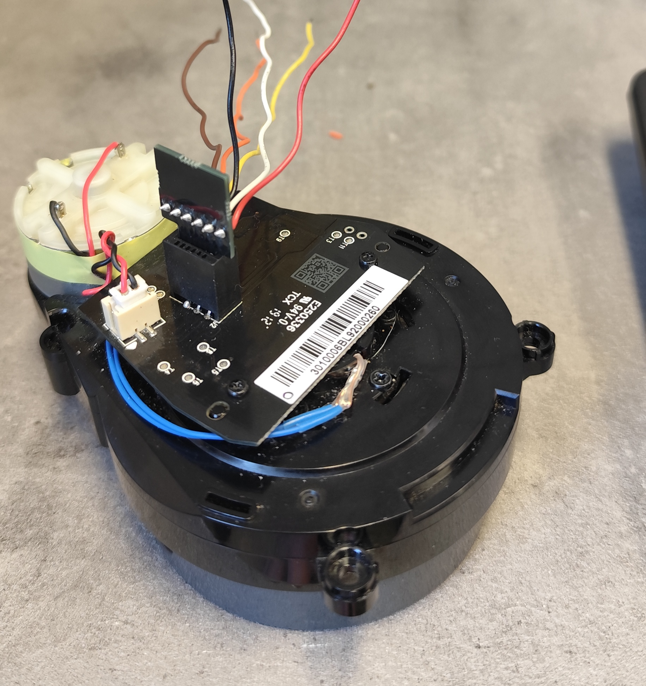
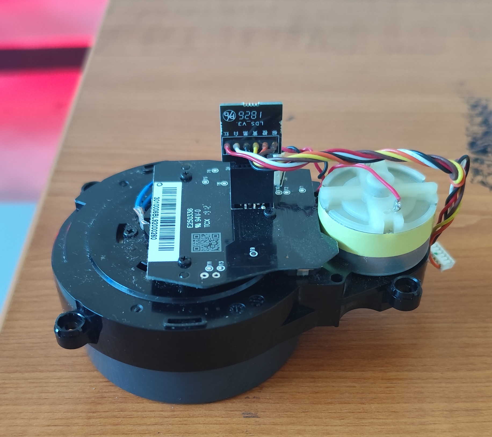
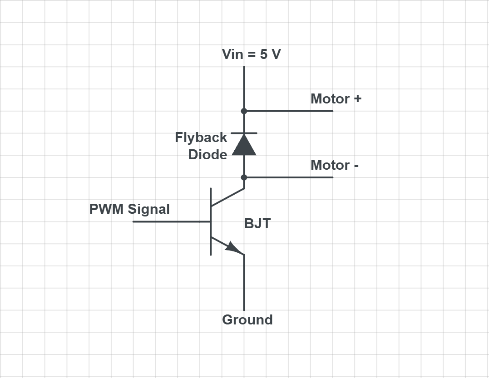
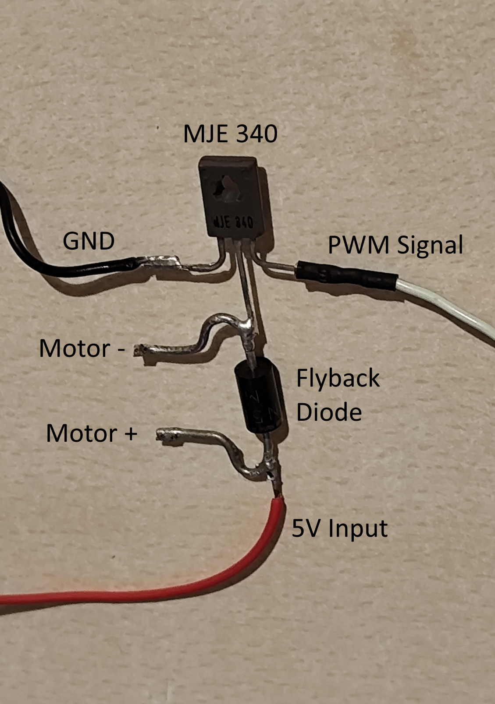
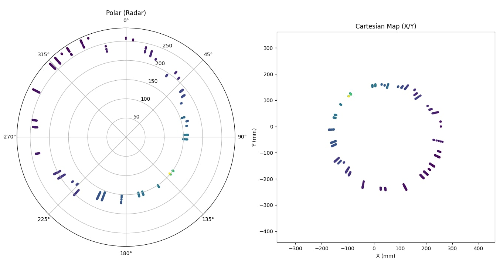

# Robot Vacuum LiDAR Reader (Powered by ESP32)



A hardware and software experiment focused on an LDS02RR LiDAR extracted from a robot vacuum.

The project aims to power and control the sensor while extracting its measurement data independently of the original electronics it was designed to operate with.

A simple visualiser written in Python is also provided to confirm readings.

## Project Overview

The project uses an **ESP32** to:
- drive the LiDAR's spinning motor using a PWM signal,
- receive and decode the LiDAR's UART stream,
- validate measurement packets using the LDS checksum,
- derive an angle from the packet index,
- print distance and signal-strength measurements over serial, and
- read the serial measurements with a Python visualiser for real-time polar and Cartesian plotting.

> **Reference:** This project uses information and resources from Roborock's official open-source **Cullinan** project:  
> https://github.com/Roborock-OpenSource/Cullinan


The project deliberately retains the original LiDAR connector and plug. This avoids desoldering the connector from the LiDAR PCB and reduces the risk of mechanically or thermally damaging the module.

## Hardware

### Main Components

| Component | Purpose |
|---|---|
| Roborock LDS02RR LiDAR | Rotating laser distance sensor |
| ESP32 | Motor PWM generation and UART decoding |
| MJE340 BJT | Low-side motor switching |
| Flyback diode | Suppresses inductive voltage spikes from the motor |
| 5 V, 1 A power supply | Powers the LiDAR motor circuit |

The LiDAR electronics and motor are treated as separate loads. The ESP32 provides the motor-control signal and processes the LiDAR data, while the motor itself is powered from a dedicated 5 V supply.


## LiDAR Connector Pinout




The original robot-vacuum connector is retained and used as the interface to the LiDAR.

The following wire functions were identified during the project:

| Wire color | Function | Connection |
|---|---|---|
| 🔴 Red | Motor + | +5 V motor supply |
| ⚫ Black | Motor − | Switched motor output |
| 🟠 Orange | LiDAR circuit Vin | LiDAR electronics supply |
| 🟤 Brown | Circuit GND | Ground |
| ⚪ White | GND | Ground |
| 🟡 Yellow | UART RX | ESP32 GPIO 16 |


## ESP32 Pinout

The current firmware uses the following ESP32 GPIOs:

| ESP32 GPIO | Direction | Function | Notes |
|---:|---|---|---|
| GPIO 5 | Output | Motor PWM | 5 kHz, 8-bit resolution |
| GPIO 16 | Input | LiDAR UART RX | 115200 baud, 8N1 |
| GND | — | Common ground | Shared between ESP32, LiDAR |

## Motor Control

The LDS02RR requires its scanning motor to be driven externally. The scanner uses a conventional two-wire DC motor.

The project uses an **MJE340 transistor as a low-side switch**.



The physical implementation is shown below.


The components used here were selected primarily based on what was available during development and are not intended to represent an optimized motor-driver design. More suitable transistor and driver combinations can be used in a refined implementation.



### Power Supply

The motor can draw substantial current while operating, so a dedicated external 5 V supply rated for at least 1 A is used for the motor-controller circuit.  
The LiDAR electronics are powered separately through their designated connector wires. In this implementation, they are supplied from the ESP32 board's 5 V rail because their current requirement is comparatively low.

### Grounding Arrangement

All parts of the system must share a common ground:

```text
ESP32 GND
    │
    ├── LiDAR circuit GND
    │
    └── Motor-controller GND
```

The motor is powered from its own 5 V supply, rated for at least 1 A. However, **the motor-supply ground and ESP32 ground must be connected together** so that the PWM control signal has a common electrical reference.

### Why the BJT is required

An ESP32 GPIO is intended for logic-level signaling and cannot safely supply the current required by the LiDAR motor. The transistor therefore acts as the switching element: GPIO 5 controls it with PWM while the motor draws its operating current from the external 5 V supply.

The flyback diode provides a path for the motor's inductive current when the transistor switches off, suppressing voltage spikes that could otherwise stress the switching transistor or introduce electrical noise into the system.

### PWM configuration

The firmware configures:

```cpp
const int pwmPin = 5;
const int pwmFrequency = 5000;
const int pwmResolution = 8;
```

The initial motor duty value is:

```cpp
int motorSpeed = 200;
```

With an 8-bit PWM resolution, the duty-cycle range is:

```text
0 ─────────────── 255
```

The current implementation also enforces:

```cpp
const int minMotorSpeed = 200;
```

This ensures that, once the control logic is running, the commanded PWM duty value does not fall below 200.

## ESP32 Firmware Flow

The main firmware sequence is:

```text
Start
 │
 ├── Initialize USB serial
 │
 ├── Configure motor PWM
 │
 ├── Start LiDAR UART at 115200 baud
 │
 └── Main loop
       │
       ├── Keep motor PWM active
       │
       ├── Read incoming UART bytes
       │
       ├── Search for 0xFA
       │
       ├── Collect 22-byte packet
       │
       ├── Validate checksum
       │
       ├── Decode packet index
       │
       ├── Calculate scan angle
       │
       ├── Decode four samples
       │
       └── Print valid measurements
```

The complete firmware is contained in:

```text
lidarReader.ino
```


## LiDAR Serial Protocol

The LiDAR outputs measurement data over UART at **115200 baud**.

A complete measurement packet is **22 bytes**:

| Offset | Size | Field |
|---:|---:|---|
| 0 | 1 | `0xFA` start byte |
| 1 | 1 | Measurement index |
| 2–3 | 2 | Speed |
| 4–7 | 4 | Sample 0 |
| 8–11 | 4 | Sample 1 |
| 12–15 | 4 | Sample 2 |
| 16–19 | 4 | Sample 3 |
| 20–21 | 2 | Checksum |

Each packet contains **four distance/strength samples**.

> **Protocol note:** Roborock's Cullinan documentation specifies index values from `0xA0` to `0xF9`, corresponding to 90 packets and 360 samples per revolution. The firmware in this repository uses an empirically observed `PACKETS_PER_REV = 86` for the particular sensor used during development; this should therefore be treated as a project-specific calibration value rather than a universal LDS02RR constant.

The packet layout and checksum implementation follow the LDS measurement format documented in Roborock's Cullinan project.


## Checksum

The firmware calculates the checksum from the first 20 bytes:

```cpp
uint16_t calcChecksum(uint8_t* b) {
  uint32_t checksum = 0;

  for (int i = 0; i < 20; i += 2)
    checksum = (checksum << 1) +
               (b[i] | (b[i+1] << 8));

  checksum = (checksum + (checksum >> 15)) & 0x7FFF;

  return (uint16_t)checksum;
}
```

The received checksum is then compared against the calculated value:

```cpp
uint16_t recv = buf[20] | (buf[21] << 8);

if (recv == calc) {
    // valid measurement packet
}
```

Packets failing the checksum comparison are discarded.


## Measurement Decoding

Each of the four samples occupies four bytes:

```text
Byte 0–1 : Distance
Byte 2–3 : Strength
```

The firmware reconstructs both values from their little-endian byte representation:

```cpp
uint16_t dist =
    buf[base] |
    (buf[base + 1] << 8);

uint16_t strength =
    buf[base + 2] |
    (buf[base + 3] << 8);
```

Invalid or zero-distance samples are ignored:

```cpp
if (dist == 0 || (dist & 0x8000))
    continue;
```

In the documented sample format, the upper bits of the second distance byte contain status flags, including the invalid-data flag. The firmware uses this flag to reject unusable measurements.

Valid samples are printed to the ESP32 serial interface as:

```text
Angle=123.45 deg, Distance=456 mm, Strength=789, Index=...
```


## Angle Calculation

The project does not use an additional physical encoder to determine the LiDAR's rotational position. Instead, the measurement-packet index is used as the angular reference.

At startup, the first received index is stored:

```cpp
indexStart = index;
```

The difference between the current index and the starting index is then calculated, with wraparound handling:

```cpp
int deltaIndex = index - indexStart;

if (deltaIndex < 0)
    deltaIndex += 256;
```

The current implementation uses an empirically observed value of approximately **86 measurement packets per revolution**:

```cpp
const int PACKETS_PER_REV = 86;
```

The resulting relative packet index is then converted to an angular position in degrees:

```cpp
float angleDeg =
    (deltaIndex / (float)PACKETS_PER_REV) * 360.0f;
```

## Visualization

The Python script `scanVisualiser/scanVisualiser.py` reads the ESP32's serial output and generates two live views. The visualiser requires `pyserial`, `matplotlib`, and `numpy` installed, as well as the ESP32 plugged and running to produce serial data.

1. **Polar/radar representation**
2. **Cartesian X/Y map**

The Python application parses lines matching:

```text
Angle=... deg, Distance=... mm, Strength=...
```

The data is stored in bounded deques so the visualization does not grow indefinitely:

```python
MAX_POINTS = 2000
```

Measurements are sorted by angle before being plotted.

The distance data is also smoothed using a moving average:

```python
SMOOTH_WINDOW = 5
```

Finally, polar measurements are converted to Cartesian coordinates:

```text
X = distance × cos(angle)
Y = distance × sin(angle)
```

This produces a simple real-time 2D point cloud representing the LiDAR's surrounding environment.

## Example Output

The included example shows the resulting visualization:

- the left plot shows the measurements in polar coordinates,
- the right plot converts the same measurements into X/Y coordinates,
- point color represents the returned signal strength.



This is a basic point-cloud visualization rather than a complete SLAM implementation. For this test, the sensor was placed inside a circular enclosure, which is reflected in the shape of the resulting scan.

## Safety / Hardware Notes

- Exercise appropriate care when working with exposed electronics and external power supplies.
- Verify the LiDAR connector pinout before applying power. Wire colors are documented for this specific project and should not automatically be assumed for another LiDAR variant.
- Do not connect the motor directly to an ESP32 GPIO.
- Use a suitable external 5 V supply rated for at least 1 A for the motor.
- Tie the external motor-supply ground to the ESP32 ground.
- The LiDAR contains a rapidly rotating mechanical assembly; keep loose wiring, fingers, and other objects clear while operating it.
- Confirm logic-level compatibility before connecting UART signals to a particular ESP32 board.

## Credits & References

- **Roborock Open Source — Cullinan**  
  https://github.com/Roborock-OpenSource/Cullinan

The Cullinan project provides public documentation of Roborock LDS systems, including the serial communication format, measurement-packet structure, sample representation, and checksum algorithm used as references during this project.

## Disclaimer

This is an independent hardware reverse-engineering and experimentation project. It is not an official Roborock product or modification.

Hardware variants may differ, so verify the connector wiring, electrical levels, and motor requirements of the particular LiDAR unit being used before applying power.
